# Zedboard HDMI and OLED Tutorial (In Progress)

The goal of this tutorial is to show how to program the Zedboard in order to display images over HDMI and to display text on its built-in OLED display.\
Both the OLED and HDMI will be controlled from software by the ARM core inside the Zynq-7000.

For the OLED, this tutorial provides a `printstr()`-like function to print up to 4 lines of text on the built-in display.\
For the HDMI, this tutorial provides a method to send a raw image stored inside the FPGA's DDR memory through the HDMI link. It reads the image from memory by using a VDMA IP, and then transmits it to the ADV7511 HDMI controller on the Zedboard. This tutorial sets up the HDMI to run at 1080p at 60 Hz.

The HDMI and OLED sections are in separate files, and can each be implemented independently, without needing the other.\
Reference material related to the Zedboard can be found [here](https://reference.digilentinc.com/reference/programmable-logic/zedboard/start).

[Zedboard Pin Assignment](https://reference.digilentinc.com/_media/reference/programmable-logic/zedboard/zedboard_ug.pdf)\
[Zedboard Schematic](https://reference.digilentinc.com/_media/reference/programmable-logic/zedboard/zedboard_sch.pdf)

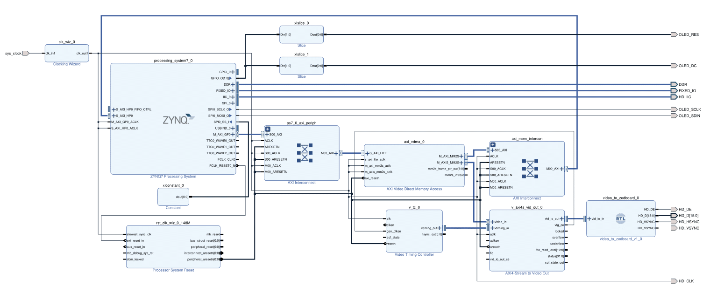

## PL Setup

The first step is to set up the FPGA's PL (Programmable Logic, the FPGA's reprogrammable hardware). While everything will be controlled from the PS (Processing System, the ARM core inside the FPGA), the PL is required to route the signals that the PS generates to the appropriate pins, and to generate signals that the PS is unable to create.

The PL setup is done using Vivado. A quick start guide can be found [here](https://reference.digilentinc.com/vivado/getting_started/start).

1. Create a new Vivado project that targets the Zedboard.\
   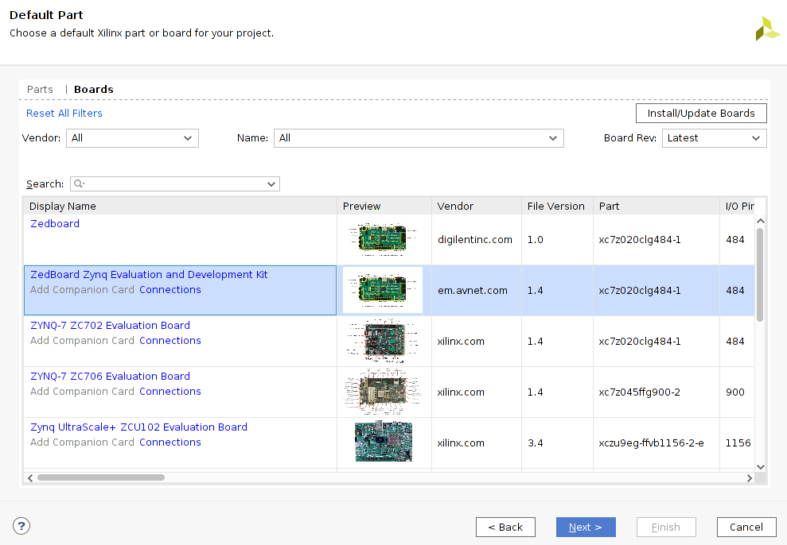
2. Include the constraints file and the Verilog file found in the `PL/` directory.
3. Create a new block design.
4. Add a Zynq Processing System to the block design and run block automation.\
   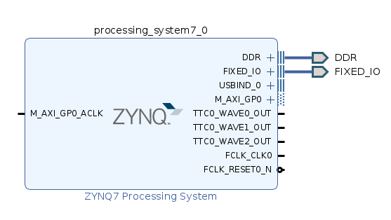

### OLED Wiring

The Zedboard has an Inteltronic/Wisechip UG-2832HSWEG04 OLED Display ([reference](https://cdn-shop.adafruit.com/datasheets/UG-2832HSWEG04.pdf)).

As seen in the schematic, the OLED Display has multiple pins connected to the FPGA.\
In order to send commands and data to the OLED, the FPGA uses a reduced subset of the SPI protocol. The FPGA has two wires connected to the OLED: a clock wire, and a data wire. Each time the OLED sees a rising edge on the clock wire, it reads the bit on the data wire.\
In addition, there is a wire called the D/C (Data/Control) wire. The OLED memory is split into two parts: the data memory, and the control registers. The data memory stores which pixels should be enabled to display the desired text. The control registers store configuration information about the OLED display itself, such as whether the OLED is currently turned on or in sleep mode. When the OLED receives bits over SPI, the D/C wire determines where those bits should be sent. If D/C=1, then the bits are sent directly in the OLED's data memory. If D/C=0, the bits are sent to the OLED's controller. The controller decodes the bits into commands, and it sets control registers accordingly. Finally, there is also a reset wire.

Thus, the high-level procedure for using the OLED is as follows: reset the OLED, set D/C=0, send the "turn on" command over SPI, set D/C=1, send the pixel bitmap over SPI.

The Zynq-7000 has a feature called EMIO, which allows it to send and receive data in common protocols directly from the ARM core. Namely, the Zynq-7000 ARM core has built-in SPI and GPIO controllers. This means the PL does not need to do any processing at all. All signals will be generated in the ARM core, and the PL simply needs to route those signals to the appropriate pins.

In a full SPI implementation, multiple master and slave devices can be connected using the same wires. A special "chip select" wire is used by a master to tell a specific slave that it is sending data only to it. In addition, if other masters see that a specific slave's "slave select" line is toggled, they will not send any messages to that slave to avoid interference. In SPI, the "slave select" line is active low. Therefore, if the ARM core's SPI controller detects that the OLED's "slave select" is low, it will believe that another master is talking to the OLED, and it will not send any data. Hence, it is necessary to tie the ARM core's "slave select" line to 1, so that the controller will transmit data.

1. Double-click the Zynq to customize it.\
   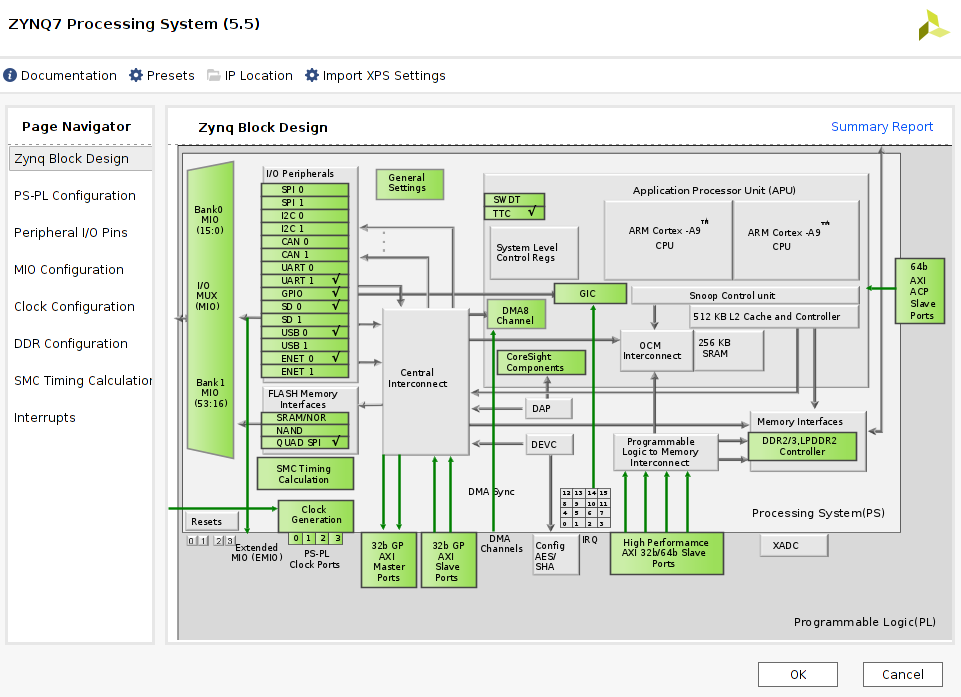
   1. In MIO Configuration, I/O Peripherals, enable SPI 0 connected to EMIO.\
      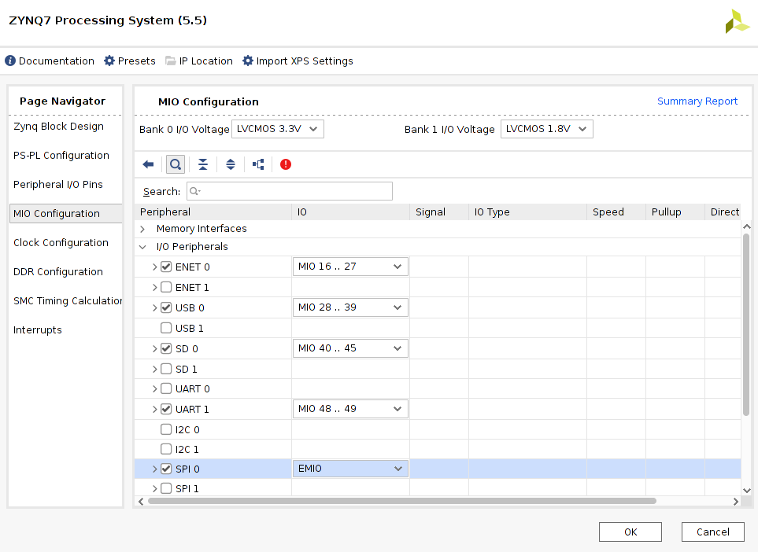
   2. In MIO Configuration, I/O Peripherals, enable EMIO GPIO of width 2. These will be used for the OLED reset and control signals.\
      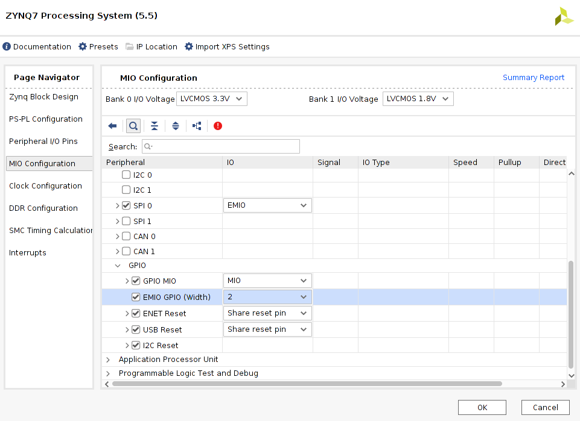
   3. Click OK and exit.
2. The Zynq block now has new output connections.\
   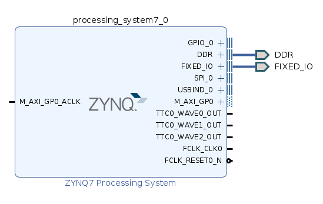
3. In the block design, create new output ports called `OLED_DC`, `OLED_RES`, `OLED_SCLK`, `OLED_SDIN`. They are connected to the OLED pins in lines 136-139 of the constraints file.\
   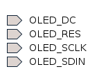
5. Add a Constant IP to the block design. Double click it, and configure it to output the constant value 1 of width 1.\
   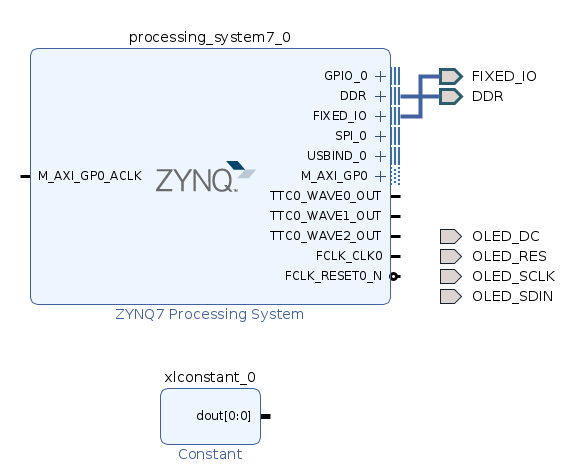\
   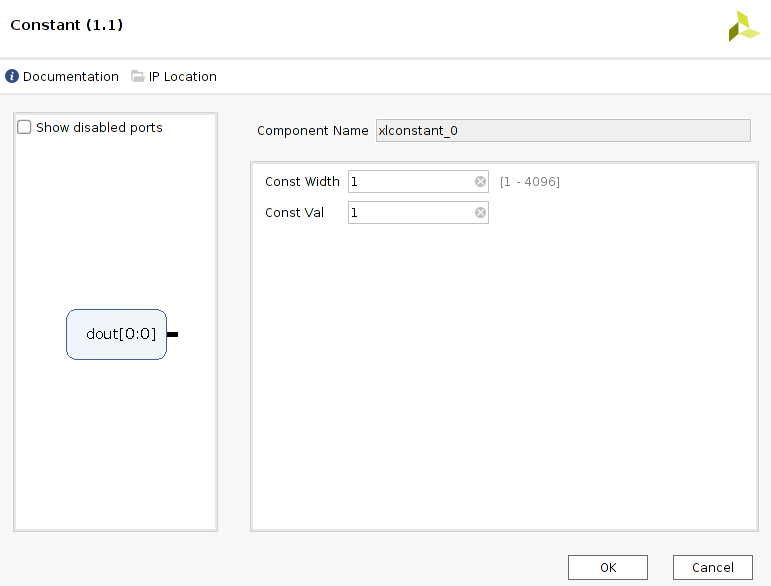
6. Expand the `SPI_0` output of the Zynq block. Connect the output of the Constant IP to `SPI0_SS_I` (the SPI slave select signal). Connect `SPI0_MOSI_O` to `OLED_SDIN` (the SPI data signal). Connect `SPI0_SCLK_O` to `OLED_SCLK` (the SPI clock signal).\
   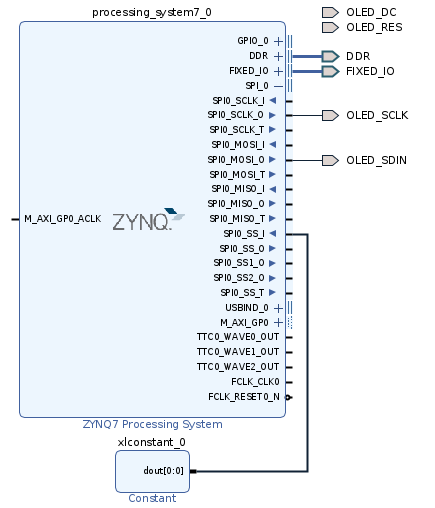
7. Add two Slice IPs. For both, set `Din Width` to 2. For one slice, set `Din From` and `Din Down To` to 0, for the other, set `Din From` and `Din Down To` to 1.\
   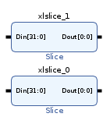\
   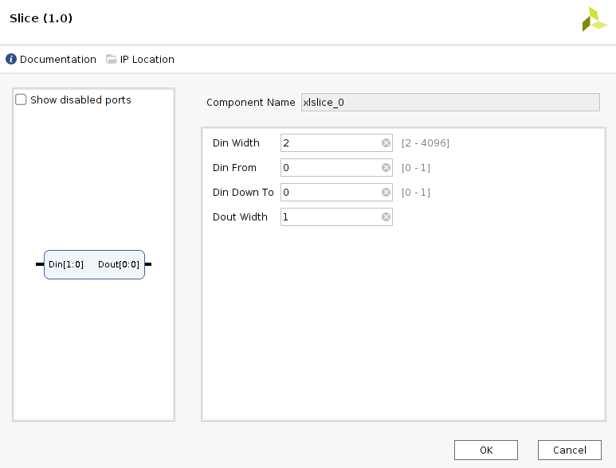\
   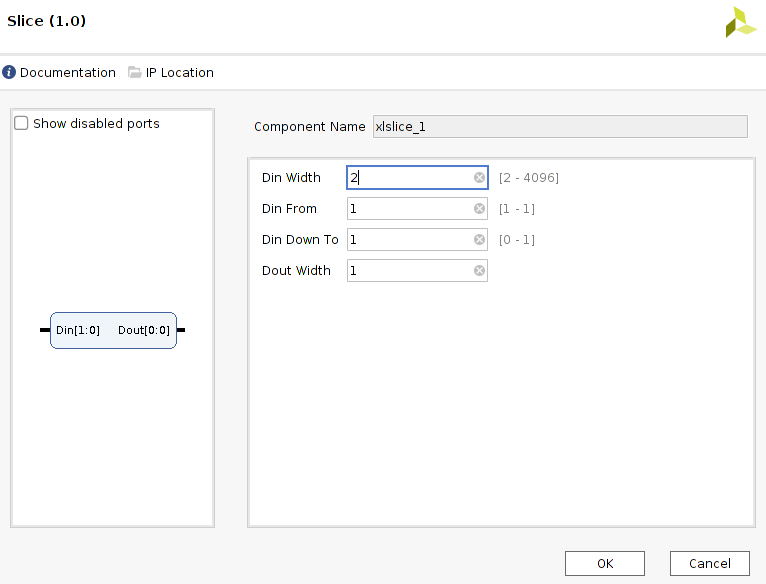
8. Connect `GPIO_O` to both Slice IPs. Connect the output of the Slice that captures `GPIO_O[0]` to `OLED_RES`. Connect the output of the Slice that captures `GPIO_O[1]` to `OLED_DC`.\
   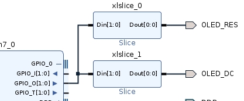
9. The Wiring for the OLED is ready, and should look like this.\
   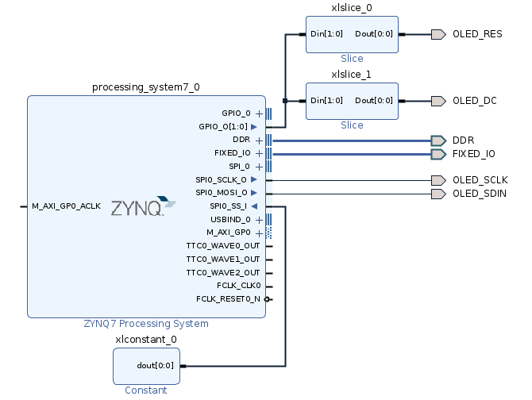
10. Only if the HDMI is not being implemented, connect `FCLK_CLK0` to `M_AXI_GP0_ACKL`, create the HDL wrapper, generate bitstream, export hardware.

### HDMI Wiring

The HDMI link is handled by an ADV7511 chip ([reference](https://www.analog.com/media/en/technical-documentation/user-guides/ADV7511_Hardware_Users_Guide.pdf)).

To protect copyrighted material, HDMI supports encrypting all the data sent over an HDMI cable so that it cannot be copied. Unfortunately, such encryption requires secret keys, and only large companies are granted access to these keys. Therefore, it is impossible to build a custom HDMI interface. To make up for this, Analog Devices provides the ADV7511, which accepts regular unencrypted video, and which takes care of the HDMI encryption internally.

There are many ways of transmitting video data. The basic idea is similar to the OLED interface: there is one clock line, and multiple data lines. On each rising edge of the clock line, the ADV7511 reads the values of the data lines. The ADV7511 supports multiple ways to encode pixel data, for example, it supports having 24 input lines, which correspond to a 24-bit input. Each 24-bit value represents the color of one pixel: the first 8 bits are the red brightness, then the green brightness, and then the blue brightness.

Unfortunately, the Zedboard schematic shows that not all of the ADV7511's input pins are connected to the FPGA. With the available input pins, the best input data format is "YCrCb 4:2:2 with Input ID = 1, Style = 3, Right Justified" (table 7 in the reference). On each rising edge of the clock, the ADV7511 receives 16 bits of data, which correspond to data for one pixel. The first 8 bits are the overall brightness of the pixel, and the next 8 bits represent the color of the pixel.\ 
Unlike RGB which encodes pixels by their red, green and blue values, YCrCb encodes pixels by their overall brightness, and their red and blue values. The overall brightness of a pixel is a linear combination of its red, green and blue values, so the green values can then be deduced from the overall brightness and the other two colors. The 4:2:2 indication implies that colors are subsampled, which means that the 8 color bits alternate between being the red and the blue values. So two neighboring pixels can have different brightnesses, but they will have the same color: the red value comes from the first pixel, and the blue value comes from the second.

The ADV7511 receives a stream of raw pixel data. The pixels are sent line-by-line. However, it also needs synchronization data to know where each of the received pixels should be located on the screen. For this, the ADV7511 receives additional signals called `HSYNC` and `VSYNC`, which provide this synchronization information. These signals date back to CRT TVs, and are tricky to implement, since they need to satisfy some precise timing conditions. In additon to these signals, there also need to be "blanking periods" between successive frames where no data is getting sent. Luckily, Xilinx provides the "AXI4-Stream to Video Out" and "Video Timing Controller" IPs that are capable of generating these timing signals and pausing the video stream during the blanking periods.

In addition to these timing-related IPs, Xilinx provides many different IPs for video processing. All of these IPs send and receive video data using AXI4-Stream interfaces. The full specification for how Xilinx IPs send video data over AXI4-Stream can be found in [UG934](https://www.xilinx.com/support/documentation/ip_documentation/axi_videoip/v1_0/ug934_axi_videoIP.pdf).\
An AXI4-Stream is a unidirectional data stream from a master to a slave. Like for the ADV7511, the stream has a clock line called `ACLK` and multiple data lines called `TDATA`. On each rising edge of the clock, the data lines carry the data for one pixel. The pixels are sent line-by-line.\
In addition, there is a "handshake" mechanism. The master outputs a `TVALID` signal which is high only when it is sending valid data. The slave outputs a `TKEEP` signal which is high only when the slave is able to accept data. This `TKEEP` signal is a way for the slave to apply back-pressure: it can tell the master to slow down because it is unable to keep up. The master is only allowed to move on to the next pixel's data when both `TVALID` and `TKEEP` are high.\
Finally, there are two additional synchronization signals. The master outputs a `TUSER` signal which is only high only for the first pixel of a frame. In addition, the master outputs a `TLAST` signal which is only high for the last pixel of each line.

For the source of the video data, Xilinx provides the VDMA IP. The VDMA (Video Direct Memory Access) reads an image stored in the FPGA's DDR memory, and outputs it as an AXI4-Stream video. For simplicity, the VDMA will always output the same image, so that the video will be static, however, it can be configuredd to output video as well.

The ADV7511 supports many different features, and it must be configured before it can be used. For this purpose, the ADV7511 has an IIC (also known as I2C) connection. Like with the OLED, the ARM core is able to generate IIC signals, so it can be wired directly to the ADV7511.

Finally, the goal is to have a system that runs at 1080p at 60 Hz. All of the IPs will be configured to operate at one pixel per clock cycle. For simplicity, everything will run on the same clock. In order to generate the right amount of throughput to send all of the pixels on time and to satisfy the blanking period, for 1080p at 60 Hz, we will need the clock to run at exactly 148.5 MHz (see [here](https://projectf.io/posts/video-timings-vga-720p-1080p/) for all the numbers).

1. Double-click the Zynq to customize it.
   1. In PS-PL Configuration, HP Slave AXI interface, enable S AXI HP0. This will be the port that the VDMA IP uses to read from DDR memory.\
      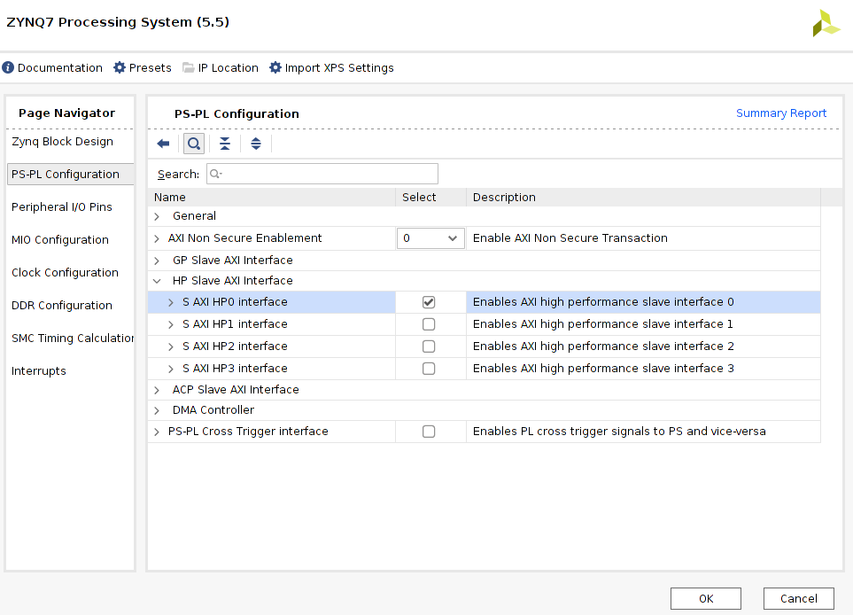
   2. In MIO Configuration, I/O Peripherals, enable I2C 0 connected to EMIO.\
      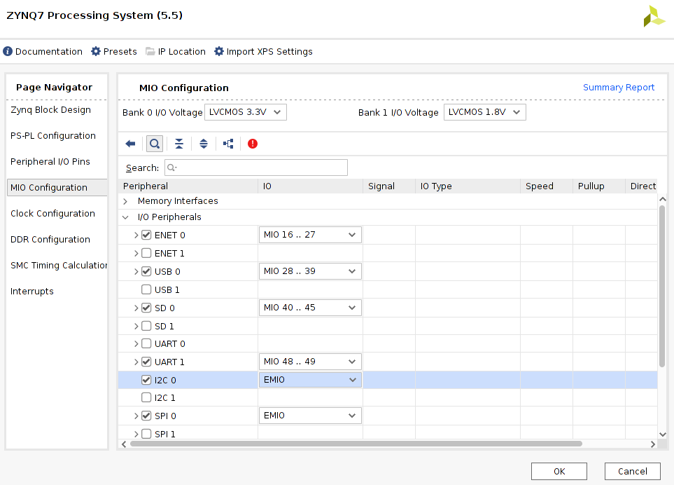
   3. Click OK and exit.
2. The Zynq block now has new output connections.\
   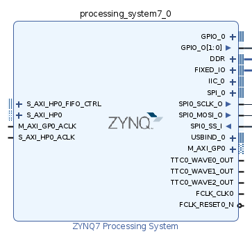
3. Left-click once on the IIC_0 port on the Zynq block, then right-click, select "Create Interface Port" and name it HD_IIC. They are connected to the ADV7511 IIC pins on lines 166-167 of the constraint file. Note: an easy way to get the full name of an interface port (`HD_IIC_scl_io` and `HD_IIC_sda_io`) is to create the HDL wrapper and look at the generated Verilog file.\
   \
   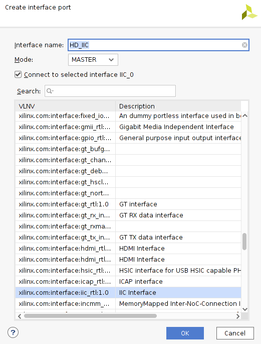\
   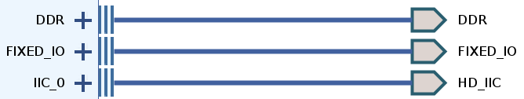
4. Add a Clocking Wizard IP. Double-click it to configure it. In Output Clocks set clock_out1 to be 148.5 MHz. At bottom of the Output Clocks page, disable the "reset" and "locked" output. Run connection automation to connect the Clocking Wizard to `sys_clock`.\
   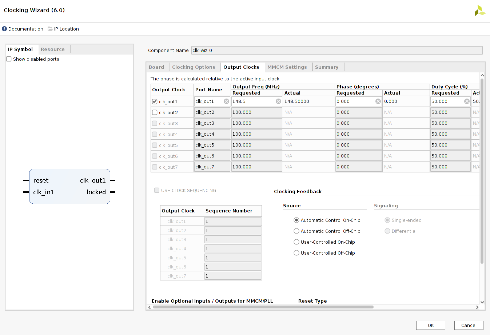\
   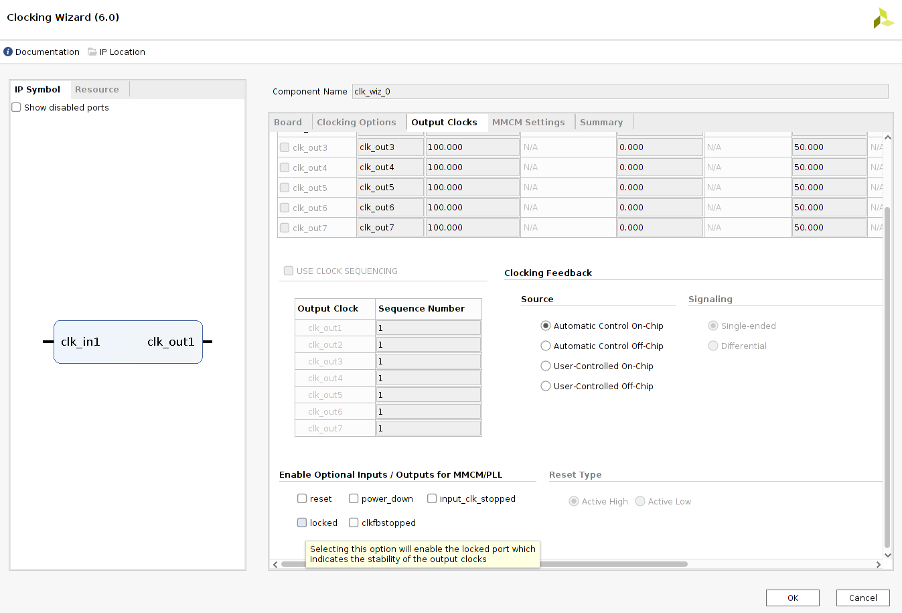\
   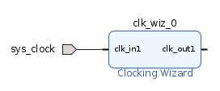
5. Add an AXI Video Direct Memory Access IP. Double-click to configure it. In the Basic page, set Frame Buffers to 1. Disable the Write channel. In the Read channel, set Stream Data Width to 16. In the Advanced page, set GenLock Mode to Master.\
   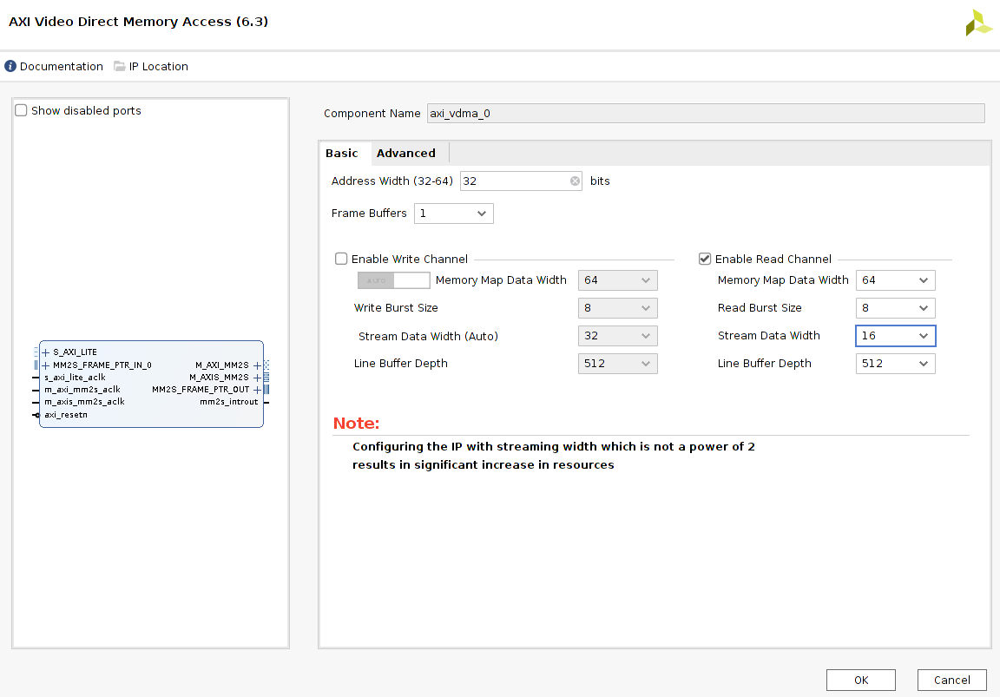\
   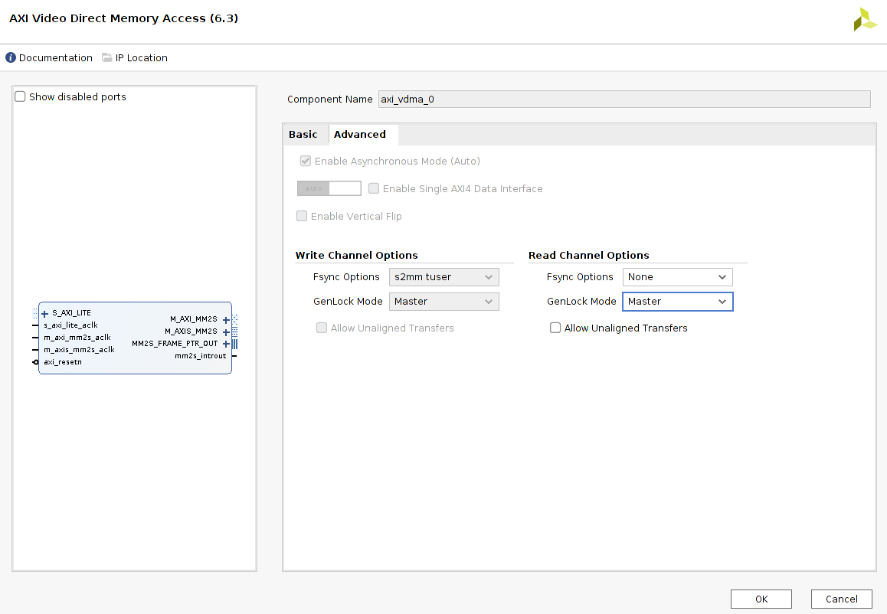
6. Add an AXI4-Stream to Video Out IP. Double-click to configure it. Set Video Format to YUV 4:2:2.\
   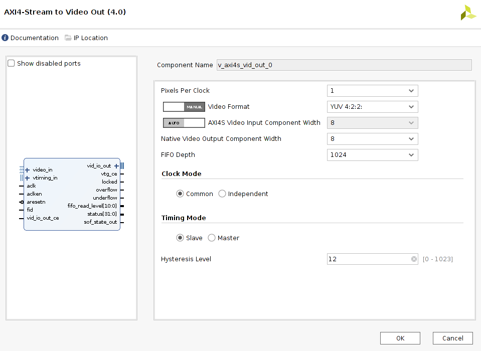
7. Add a Video Timing Controller IP. Double-click to configure it. In the Detection/Generation page, disable the AXI4-Lite interface and disable Detection. In the Default/Constant page, set video mode to 1080p.
   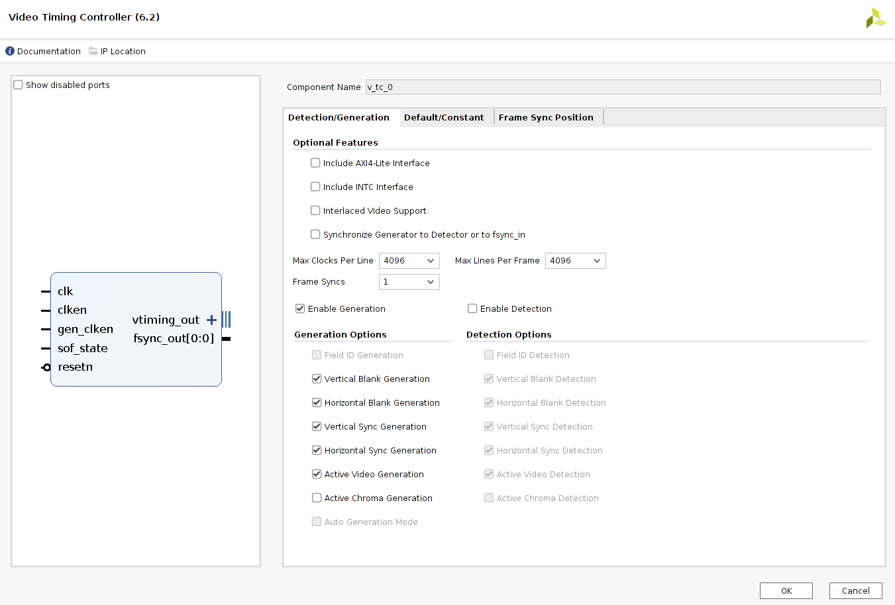\
   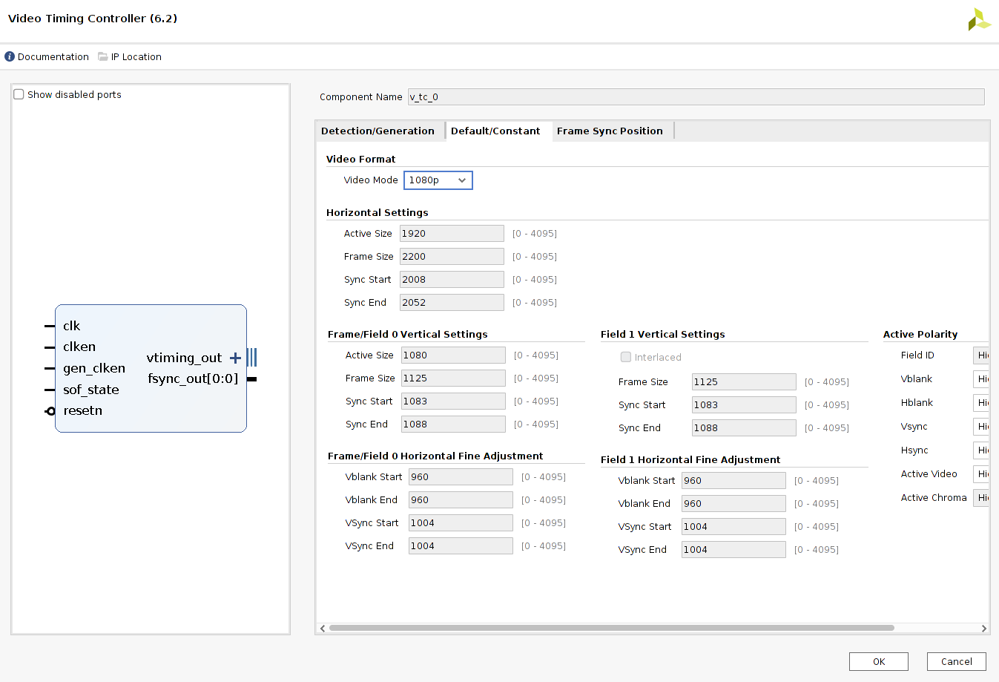
8. The block design should now look like this.\
   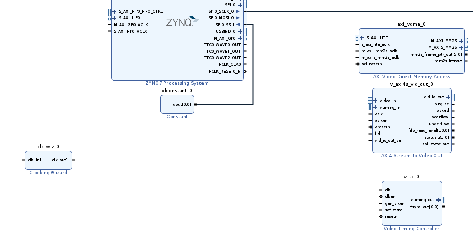
9. Connect the output of the Clocking Wizard to `M_AXI_GP0_ACLK` and `S_AXI_HP0_ACLK` on the Zynq block, to all three clock inputs on the VDMA, to `aclk` on the AXI4-Stram to Video Out, and to `clk` on the Video Timing Controller.\
   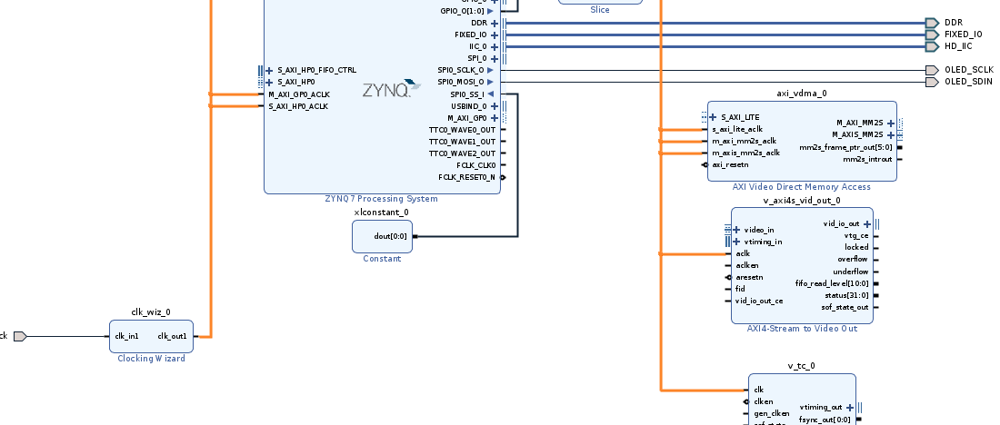
10. Connect the VDMA's `M_AXIS_MM2S` to `video_in` and the VTC's `vtiming_out` into `vtiming_in`.\
    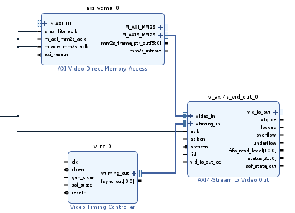
11. Run all connection automations.\
    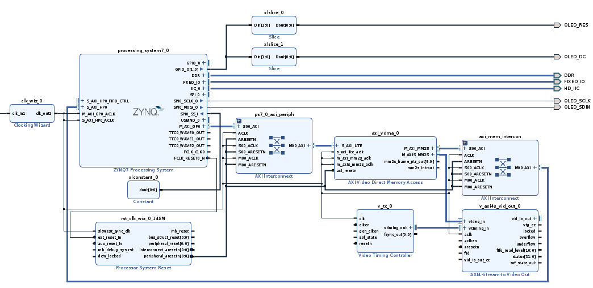
12. You may need to manually connect the output of the reset block into the `resetn` input of the VTC and the `aresetn` input of the AXI4-Stram to Video Out.\
    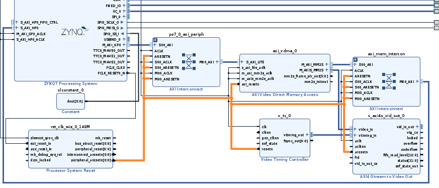
13. Connect the `vtg_ce` output of the AXI4-Stram to Video Out IP to `gen_clken` on the VTC.\
    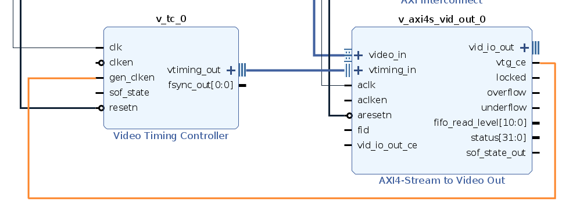
14. Right click on the block design and click Add Module. Add the `video_to_zedboard` module. Connect it.\
    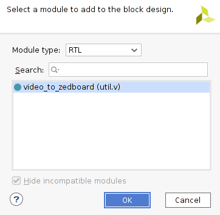\
    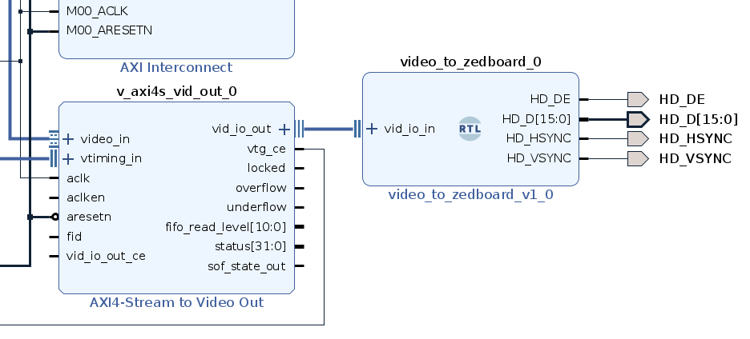
15. Create a new output port called `HD_CLK` and connect it to the output of the Clocking Wizard.\
    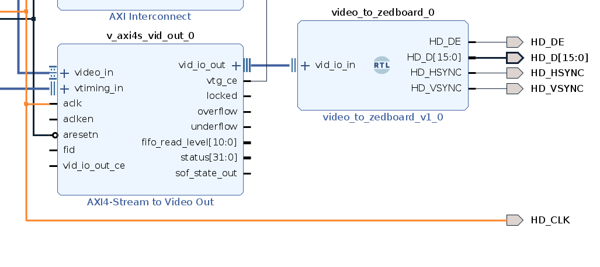
16. The block design is now done! Create HDL wrapper, generate bitstream, export hardware.\
    

## PS Setup

Once the block design is done, import the hardware into Vitis, create a new empty project, and copy the C sources into the project. By default, the C sources contain the code for both the HDMI and OLED controllers. To disable one of them, simply edit the `main.c` file.

To use the HDMI component, first pick the image that the device will display on the screen. Run the `image-to-memory-map.py` script, which will converts the provided image into a file called `image.h`. This file contains a memory map of the image. Include this `image.h` file in the sources.

In addition, **the HDMI cable must be connected before flashing the bitstream**. The ADV7511 can only be activated if the cable is connected.

### OLED Functions

All OLED-related functions are found in the `ps_emio.h`, `ps_emio.c` and `oled_font.h` files.

The files `ps_emio.h` and `ps_emio.c` implement the following three functions:
- `int init_ps_emio()`. This function initializes the ARM core's SPI and GPIO controllers, and sends a turn-on command to the OLED display.
- `void cleanup_ps_emio()`. This function sends a turn-off command to the OLED display.
- `void oled_printstr(char *str)`. This function prints the null-terminated string `*str`. If the string is too long, it will be truncated.

The file `oled_font.h` describes the font to be displayed on the OLED.

### HDMI Functions

All HDMI-related functions are found in the `zed_hdmi.h` and `zed_hdmi.c` files.

They implement the following functions:
- `int init_hdmi_interface()`. This function intitializes the ARM core's I2C controller, and sends all the configuration information to the ADV7511.
- `void cleanup_hdmi_interface()`. This function sends a shutdown command to the ADV7511.

Finally, the VDMA module is configured in the `main.c` file. It needs to know the address of the image to display, and the resolution.

## Additonal Resources

The Xilinx Video IP ecosystem is described in detail in the [Xilinx Video Series](https://forums.xilinx.com/t5/Video-and-Audio/Xilinx-Video-Series/td-p/849583) of tutorials.

Other tutorials related to the Zedboard and the Zynq can be found in [Adam Taylor’s MicroZed(ish) Chronicles](https://forums.xilinx.com/t5/Xcell-Daily-Blog-Archived/Adam-Taylor-s-MicroZed-ish-Chronicles-Part-84-Simple/ba-p/631697).
